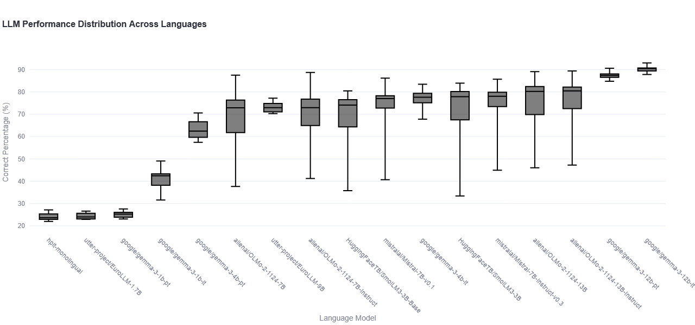

# The Great European AI Language Championship: A Comprehensive Analysis of Multilingual AI Performance

_European Tech Sovereignty Meets Global AI Competition - A Comprehensive Analysis by Nodehaus_

---

## Advancing Global AI Accessibility Through Linguistic Diversity

Picture this: In one corner, we have the heavyweight champions from Silicon Valley - Google's Gemma models flexing their massive parameter counts. In the opposite corner, Europe's rising stars - EuroLLM and HPLT models - representing European tech sovereignty and linguistic diversity. And entering from the open-source corner, we have the scrappy underdogs: Allen AI's OLMo and HuggingFace's SmolLM3, fighting with full transparency and reproducible training.

At **Nodehaus**, we're an AI agency that builds custom platforms using specialized AI models in your own workflows. We're particularly focused on developing solutions for AI support in EU languages within the legal sector. This isn't just academic research for us - it's about **European digital sovereignty** and ensuring that European businesses and institutions can deploy AI systems locally, protecting their data and intellectual property while serving their linguistic communities effectively.

## Why This Fight Matters: European Tech Sovereignty in the AI Era

### The Stakes: More Than Just Performance Numbers

This competition isn't just about who gets the highest score. It's about:

**🇪🇺 European Digital Sovereignty**: Can Europe build AI systems that rival American and Chinese offerings? The EU has invested heavily in projects like [EuroLLM.io](https://eurollm.io/) and [OpenEuroLLM.eu](https://openeurollm.eu/) to create datasets and models specifically for European languages. The HPLT models and EuroLLM models we're testing today are direct results of these ambitious initiatives.

**🔒 Privacy and Local Deployment**: In an era where data protection and IP security are paramount, the ability to run models locally on your own hardware - whether that's a home computer GPU or your company's data center - is crucial. No data leaves your infrastructure, no API calls to foreign servers, no compliance nightmares.

**🌍 Linguistic Justice**: While English dominates the AI world, over 450 million Europeans speak languages other than English as their primary language. These communities deserve AI systems that understand their linguistic nuances and cultural contexts.

**💡 Open Source Innovation**: We specifically included models like SmolLM3 and OLMo because of their commitment to true openness - not just open weights, but open training data, training scripts, and full reproducibility. This transparency enables innovation and allows smaller players to compete with tech giants.

## The Contestants: Meet Our Champions

### 🥊 **Team Europe: The Home Advantage**

-   **EuroLLM Models (1.7B & 9B)**: Born from EU research initiatives, these models were trained specifically for European languages
-   **HPLT Monolingual Models**: Language-specific specialists, each trained on individual European languages
-   **Mistral Models (7B variants)**: France's answer to OpenAI, representing European commercial AI excellence

### 🥊 **Team Global Giant: The Heavy Hitters**

-   **Google Gemma 3 Series (1B, 4B, 12B)**: Mountain View's multilingual powerhouses, available in both pretrained and instruction-tuned variants

### 🥊 **Team Open Source: The Transparent Challengers**

-   **Allen AI's OLMo Models (7B & 13B)**: Fully open training, data, and methodology - no black boxes here
-   **HuggingFace's SmolLM3 (3B variants)**: Compact but mighty, proving that size isn't everything

## The Battleground: European Languages Put to the Test

Our multilingual arena features eight European languages, each representing different linguistic families and resource levels:

-   **🇬🇧 English** (eng_Latn) - The lingua franca baseline
-   **🇩🇪 German** (deu_Latn) - Europe's economic powerhouse language
-   **🇫🇷 French** (fra_Latn) - The language of diplomacy
-   **🇪🇸 Spanish** (spa_Latn) - Globally spoken, European rooted
-   **🇮🇹 Italian** (ita_Latn) - Romance language with rich cultural heritage
-   **🇵🇱 Polish** (pol_Latn) - Representing Slavic linguistic complexity
-   **🇵🇹 Portuguese** (por_Latn) - Bridge between continents
-   **🇪🇪 Estonian** (est_Latn) - The Finno-Ugric underdog with a smaller language community

Each contestant faced the same challenge: the **Belebele benchmark** - a multilingual reading comprehension with multiple choice questions that doesn't pull any punches.

## Round-by-Round Analysis: Performance Distribution by Model

_Box plot showing each model's consistency and peak performance across all European languages. The further right, the better the median performance._

Looking at our championship bracket, several patterns emerge:

1. **📊 The Heavyweight Division**: Large instruction-tuned models dominate the leaderboard
2. **🎯 Consistency Champions**: Some models maintain steady performance across all languages (small boxes)
3. **⚡ Volatile Performers**: Others show dramatic swings between languages (large boxes)
4. **🏆 The Sweet Spot**: Models around 7-13B parameters seem to hit the best performance-per-parameter ratio

One of the surprising results in our championship was the unexpectedly poor performance of both the HPLT monolingual models and the EuroLLM-1.7B variant, which clustered at the bottom of our leaderboard with performance barely above random chance (24-25% on multiple-choice questions). This stands in contrast to [claims of higher performance published by the HPLT project](https://openeurollm.eu/blog/hplt-oellm-38-reference-models), suggesting that either our evaluation methodology, the specific benchmark used, or the model configurations may not align with their optimal use cases. This discrepancy highlights a critical point for the European AI community: **benchmark standardization and evaluation methodology matter immensely**. These models may excel in different tasks or require specific prompting strategies that weren't captured in our Belebele reading comprehension evaluation. Further investigation is needed to understand whether this represents a fundamental limitation or a mismatch between model design and our evaluation approach.

## The Final Scorecard: Championship Results

Our comprehensive analysis reveals clear winners and surprising upsets. Here's how our contestants performed across all eight European languages:

<table border="1" class="dataframe model-summary-table" id="model-summary">
  <thead>
    <tr style="text-align: right;">
      <th>MODEL</th>
      <th>Mean %</th>
      <th>Std Dev</th>
      <th>Min %</th>
      <th>Max %</th>
      <th>Languages</th>
    </tr>
  </thead>
  <tbody>
    <tr>
      <th>google/gemma-3-12b-it</th>
      <td>90.28</td>
      <td>1.52</td>
      <td>87.82</td>
      <td>92.96</td>
      <td>8</td>
    </tr>
    <tr>
      <th>google/gemma-3-12b-pt</th>
      <td>87.42</td>
      <td>1.68</td>
      <td>84.80</td>
      <td>90.61</td>
      <td>8</td>
    </tr>
    <tr>
      <th>google/gemma-3-4b-it</th>
      <td>76.94</td>
      <td>4.63</td>
      <td>67.82</td>
      <td>83.46</td>
      <td>8</td>
    </tr>
    <tr>
      <th>allenai/OLMo-2-1124-13B-Instruct</th>
      <td>75.87</td>
      <td>13.34</td>
      <td>47.26</td>
      <td>89.39</td>
      <td>8</td>
    </tr>
    <tr>
      <th>allenai/OLMo-2-1124-13B</th>
      <td>75.00</td>
      <td>14.09</td>
      <td>46.03</td>
      <td>89.05</td>
      <td>8</td>
    </tr>
    <tr>
      <th>mistralai/Mistral-7B-Instruct-v0.3</th>
      <td>74.18</td>
      <td>12.48</td>
      <td>44.92</td>
      <td>85.70</td>
      <td>8</td>
    </tr>
    <tr>
      <th>utter-project/EuroLLM-9B</th>
      <td>73.14</td>
      <td>2.43</td>
      <td>70.28</td>
      <td>77.21</td>
      <td>8</td>
    </tr>
    <tr>
      <th>mistralai/Mistral-7B-v0.1</th>
      <td>72.86</td>
      <td>13.69</td>
      <td>40.67</td>
      <td>86.15</td>
      <td>8</td>
    </tr>
    <tr>
      <th>HuggingFaceTB/SmolLM3-3B</th>
      <td>71.05</td>
      <td>17.05</td>
      <td>33.41</td>
      <td>83.91</td>
      <td>8</td>
    </tr>
    <tr>
      <th>allenai/OLMo-2-1124-7B-Instruct</th>
      <td>69.90</td>
      <td>14.33</td>
      <td>41.23</td>
      <td>88.72</td>
      <td>8</td>
    </tr>
    <tr>
      <th>allenai/OLMo-2-1124-7B</th>
      <td>68.41</td>
      <td>15.64</td>
      <td>37.65</td>
      <td>87.49</td>
      <td>8</td>
    </tr>
    <tr>
      <th>HuggingFaceTB/SmolLM3-3B-Base</th>
      <td>68.27</td>
      <td>15.09</td>
      <td>35.75</td>
      <td>80.45</td>
      <td>8</td>
    </tr>
    <tr>
      <th>google/gemma-3-4b-pt</th>
      <td>63.20</td>
      <td>4.60</td>
      <td>57.43</td>
      <td>70.61</td>
      <td>8</td>
    </tr>
    <tr>
      <th>google/gemma-3-1b-it</th>
      <td>41.08</td>
      <td>5.19</td>
      <td>31.62</td>
      <td>49.05</td>
      <td>8</td>
    </tr>
    <tr>
      <th>google/gemma-3-1b-pt</th>
      <td>25.17</td>
      <td>1.49</td>
      <td>23.13</td>
      <td>27.60</td>
      <td>8</td>
    </tr>
    <tr>
      <th>utter-project/EuroLLM-1.7B</th>
      <td>24.37</td>
      <td>1.49</td>
      <td>22.91</td>
      <td>26.59</td>
      <td>8</td>
    </tr>
    <tr>
      <th>hplt-monolingual</th>
      <td>24.12</td>
      <td>1.73</td>
      <td>22.01</td>
      <td>27.15</td>
      <td>8</td>
    </tr>
  </tbody>
</table>

**🏆 The Championship Results are in!** Google's Gemma-3-12B-IT takes the crown with an outstanding 90.28% average performance and remarkable consistency (just 1.52% standard deviation). However, the real story lies in the surprising performances across different weight classes and the critical importance of choosing the right model for your specific linguistic community.

## Fight Analysis: Key Takeaways from the Championship

### 🥇 **The Heavyweight Champions: Size and Instruction Tuning Matter**

Google's Gemma-3-12B models dominate the leaderboard, but notice the crucial detail: **instruction-tuned variants significantly outperform their pretrained counterparts**. The 12B-IT model doesn't just win - it wins with consistency, showing minimal variation across all European languages.

### 🥈 **The European Contenders: Punching Above Their Weight**

**EuroLLM-9B deserves special recognition** - with a solid 73.14% average and the **second-best consistency** (2.43% standard deviation), it proves that European AI initiatives can compete with global giants. More importantly, it was specifically designed for European languages, making it a strategic choice for EU organizations prioritizing digital sovereignty.

### 🥉 **The Open Source Heroes: Transparency Without Compromise**

Allen AI's OLMo models perform impressively, with the 13B-Instruct variant achieving 75.87% average performance. **These models offer complete transparency** - training data, scripts, and methodologies are all open source, enabling organizations to understand exactly what they're deploying.

### 🏅 **The Efficiency Champions: SmolLM3's David vs. Goliath Story**

HuggingFace's SmolLM3-3B achieves 71.05% performance with just 3 billion parameters - proving that **smart architecture and training can rival much larger models**. For organizations with limited computational resources, this represents exceptional value.

### ⚠️ **The Consistency Challenge: Why Standard Deviation Matters**

Notice the dramatic differences in standard deviation:

-   **EuroLLM-9B (2.43%)**: Rock-solid consistency across languages
-   **OLMo-13B-Instruct (13.34%)**: High peaks but concerning valleys
-   **SmolLM3-3B (17.05%)**: Excellent average, but wildly variable

**This matters immensely for deployment.** A model with high average performance but large standard deviation might excel in German but fail catastrophically in Estonian. **For European organizations serving diverse linguistic communities, consistency is often more valuable than peak performance.**

## Strategic Implications: Choosing Your Champion

### **For European Legal and Enterprise Applications**

Our analysis reveals critical considerations for organizations building AI systems for European markets:

**🎯 Language Community Strategy**: The performance gaps between languages highlight the importance of **multilingual evaluation** before deployment. A model that works well for French legal documents might struggle with Polish contracts. **Test in your target languages, not just English.**

**🔐 Privacy-First Deployment**: All tested models can run locally on modern GPU infrastructure, eliminating the need to send sensitive data to external APIs. For legal applications handling confidential client information, this local deployment capability is non-negotiable.

**⚖️ The Sovereignty Trade-off**: EuroLLM models might not top the performance charts, but they represent **European technological independence**. For critical infrastructure and sensitive applications, this sovereignty might outweigh pure performance metrics.

### **Recommendations by Use Case**

**🏢 Enterprise Legal Applications**:

-   **Champion**: Gemma-3-12B-IT for maximum accuracy
-   **European Alternative**: EuroLLM-9B for sovereignty and consistency
-   **Budget Option**: SmolLM3-3B for resource-constrained environments

**🏛️ Public Sector and Government**:

-   **Primary**: EuroLLM-9B (European-developed, consistent performance)
-   **Backup**: OLMo-13B-Instruct (fully transparent, auditable)

**🚀 Startups and Innovation**:

-   **Agile Choice**: SmolLM3-3B (efficient, transparent, cost-effective)
-   **Scale-up Path**: Mistral-7B-Instruct (European commercial option)

## The Road Ahead: European AI Independence

This championship represents more than benchmark scores - it's a snapshot of **European progress toward AI sovereignty**. The EU's investments in EuroLLM and OpenEuroLLM initiatives are paying off, producing models that can compete globally while serving European linguistic and regulatory needs.

### **What's Next for European AI**

1. **Continued Investment**: Especially the EuroLLM project demonstrate that targeted European investment can produce competitive results. The HPLT project is an early stage with promising advances in [dataset creation](https://openeurollm.eu/blog/multisynt-synthetic-training-data).
2. **Open Source Leadership**: European organizations should continue supporting truly open models like OLMo and SmolLM3.
3. **Local Deployment Focus**: The ability to run models locally provides a crucial competitive advantage in privacy-conscious European markets.
4. **Community Building**: Organizations like Nodehaus will continue building tools and platforms that make these models accessible to European businesses.

### **Join the Movement**

At **Nodehaus**, we're not just observers - we're active participants in building European AI independence. We collaborate openly, advance multilingual evaluations, and develop practical solutions that European organizations can deploy with confidence.

**The future of European AI isn't just about competing with Silicon Valley - it's about building systems that reflect European values of privacy, transparency, linguistic diversity, and digital sovereignty.**

---

_This analysis represents our ongoing commitment to European tech sovereignty and multilingual AI accessibility. All evaluation data, analysis tools, and methodologies are available for further research and validation. Together, we're building AI that serves all European communities, in all European languages._
