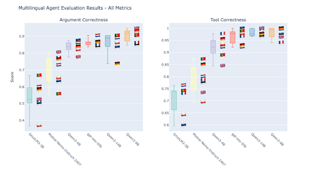
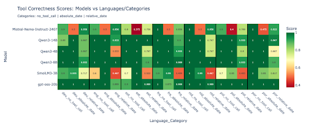
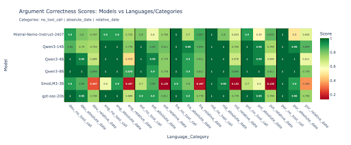

# Beyond Text Understanding: Evaluating AI Agents Across European Languages

_From Reading Comprehension to Real-World Tool Use - A Multilingual Agent Evaluation by Nodehaus_

---

## From Words to Actions: The Next Frontier in Multilingual AI

Following our [comprehensive analysis of European language model performance](https://substack.com/home/post/p-172471752), we discovered something intriguing: while large language models excel at understanding text across multiple languages, **how do they perform when they need to take actions in multilingual environments?**

This question led us down a fascinating rabbit hole. Most AI evaluation focuses on passive understanding - answering questions, translating text, or completing sentences. But modern AI applications require something far more complex: **agentic behavior**. Models need to understand user requests, decide which tools to use, call those tools with correct parameters, and integrate the results into coherent responses.

**The challenge:** There was no standardized way to evaluate how well AI agents perform across different languages. So we built our own.

## The Multilingual Agent Challenge: More Than Just Translation

### Why Agent Evaluation Matters

Unlike traditional language tasks, agentic evaluation tests **functional intelligence** - the ability to:

-   **Parse user intent** across linguistic nuances
-   **Select appropriate tools** from available options
-   **Extract and format parameters** correctly for API calls
-   **Handle temporal reasoning** ("tomorrow", "next week") in different languages
-   **Gracefully decline** requests outside their scope

These skills represent the core of practical AI deployment in European organizations serving diverse linguistic communities.

### The Missing Piece: Multilingual Agent Benchmarks

While frameworks like [EuroEval](https://euroeval.com) provide excellent monolingual benchmarks, and [MAPS](https://arxiv.org/abs/2412.03082) promises multilingual agent evaluation (though not yet published), we found a critical gap: **no available tool for evaluating agent performance across European languages today**.

## Our Solution: A Custom Multilingual Agent Evaluation Framework

### The Weather Agent: Simple but Revealing

We designed a focused evaluation around a weather information agent with two core tools:

-   `get_current_date()` - Returns today's date
-   `weather_forecast(city: str, date: str)` - Fetches weather data

This seemingly simple setup reveals sophisticated challenges:

**🗓️ Temporal Reasoning**: "What's the weather in Porto tomorrow?" requires the agent to:

1. Call `get_current_date()` to establish temporal context
2. Calculate tomorrow's date
3. Call `weather_forecast("Porto", "2025-09-12")`

**🌍 Geographic Knowledge**: Place names must be correctly identified and often translated to English for API calls

**🚫 Scope Recognition**: The agent should politely decline non-weather requests

### Evaluation Categories: Three Levels of Complexity

Our 45-question evaluation dataset spans three categories:

1. **No Tool Calls** (10 questions): Requests outside the agent's scope - testing boundary recognition
2. **Absolute Dates** (20 questions): Specific dates like "September 15th, 2025" - testing parameter extraction
3. **Relative Dates** (15 questions): "Tomorrow", "next week" - testing temporal reasoning

### Metrics: Precision Over Judgment

Unlike LLM-as-judge approaches, we use **deterministic evaluation**:

-   **Tool Correctness**: Did the agent call the right tools in the right sequence?
-   **Argument Correctness**: Were the parameters (city names, dates) correctly formatted and did the agent calculate the correct dates for relative dates?

This approach eliminates judge bias and provides reproducible results across languages.

## The Contestants: A Diverse Field of Multilingual Models

We evaluated six models across seven European languages (German, English, Estonian, French, Dutch, Polish, Portuguese):

### **🏆 The Champions**

-   **Qwen3-14B**: Alibaba's flagship multilingual model that still runs on a single GPU
-   **Qwen3-8B & 4B**: Smaller variants testing efficiency
-   **GPT-OSS-20B**: Open-source GPT-style architecture

### **🇪🇺 European Representatives**

-   **Mistral-Nemo-Instruct-2407**: France's commercial AI offering

### **🔧 The Efficiency Expert**

-   **SmolLM3-3B**: HuggingFace's compact and open powerhouse

## Results: Surprising Discoveries in Multilingual Agent Performance

### Finding #1: English Isn't Always the Best

**Contrary to expectations, English didn't consistently outperform other European languages.** Dutch emerged as the top performer (86.0% average), followed closely by Portuguese (84.9%) and German (84.8%). English ranked 5th at 84.1%.

This challenges the assumption that English-centric training automatically translates to English-language superiority in agentic tasks.

### Finding #2: Qwen3-8B Punches Above Its Weight Class

**Qwen3-8B matched or exceeded larger models while requiring significantly less computational resources.** With performance on par with Qwen3-14B and GPT-OSS-20B, it offers the best performance-to-VRAM ratio for multilingual agent deployment.

**Performance Highlights:**

-   **Qwen3-8B**: 96.7% tool correctness
-   **Qwen3-14B**: 97.8% tool correctness
-   **GPT-OSS-20B**: 98.6% tool correctness

### Finding #3: Relative Dates Reveal Language-Specific Challenges

**Relative temporal expressions proved the most challenging across all models and languages.** Performance patterns:

-   **Qwen3-8B**: 90.5% argument correctness
-   **Qwen3-14B**: 86.2% argument correctness
-   **GPT-OSS-20B**: 86.7% argument correctness

**Language-specific temporal reasoning** ("morgen" vs "tomorrow" vs "demain") adds computational overhead that affects even sophisticated models. We found that specifically GPT-OSS-20B often fails in calculating the correct dates, although it correctly identifies the current date and during "thinking" the number of days between the current date and relative dates like "next Tuesday".

### Finding #4: Consistent Performance Across European Languages

Despite varying linguistic families and training data availability, performance remained remarkably consistent:

-   **Dutch**: 86.0% (Germanic)
-   **Portuguese**: 84.9% (Romance)
-   **German**: 84.8% (Germanic)
-   **French**: 84.7% (Romance)
-   **English**: 84.1% (Germanic)
-   **Estonian**: 81.3% (Finno-Ugric, lesser-resourced)
-   **Polish**: 80.9% (Slavic)

**Lesser-resourced languages like Estonian and Polish showed only modest performance degradation**, suggesting robust multilingual training in modern models.

## Strategic Implications: Choosing Your Multilingual Agent Architecture

### **For European Organizations: The Sovereignty vs. Performance Balance**

**🎯 Maximum Performance**: Qwen3-14B delivers top-tier results but requires significant computational resources

**⚖️ Optimal Efficiency**: Qwen3-8B provides 95%+ of the performance with 40% less VRAM - ideal for most production deployments

**🇪🇺 European Alternative**: Mistral-Nemo-Instruct-2407 offers competitive performance (74.1% tool correctness) with European provenance

### **Deployment Recommendations by Use Case**

**🏢 Enterprise Applications**:

-   **Primary**: Qwen3-8B (efficiency + performance)
-   **High-scale**: Qwen3-14B (maximum accuracy)
-   **European preference**: Mistral-Nemo-Instruct-2407

**💻 Resource-Constrained Environments**:

-   **Budget champion**: SmolLM3-3B (acceptable performance, minimal resources)
-   **Scale-up path**: Qwen3-4B (balanced middle ground)

**🔧 Development & Prototyping**:

-   **Rapid iteration**: Qwen3-4B
-   **Production preview**: Qwen3-8B

## Building Your Own Evaluation: Lessons Learned

### **Custom Evaluation in One Week**

Our experience demonstrates that **building domain-specific agent evaluation is surprisingly accessible**:

1. **Day 1-2**: Define agent scope and tool specifications
2. **Day 3-4**: Generate evaluation dataset in 7 languages using Claude Code
3. **Day 5**: Human review and refinement
4. **Day 6-7**: Implement and run evaluation

**Key insight**: AI-assisted dataset creation accelerates what previously required months of manual work.

## The Path Forward: European AI Agent Development

### **Immediate Opportunities**

1. **Custom Fine-tuning**: Models like Qwen3-8B provide excellent foundations for language + task-specific optimization
2. **Inference Optimization**: Future evaluations should include speed benchmarks alongside accuracy
3. **Tool Complexity**: Expanding beyond weather to document processing, database queries, and API orchestration

### **European AI Strategy**

Our results suggest **European organizations can deploy world-class multilingual agents today** without compromising on digital sovereignity or linguistic inclusivity. The performance gap between models is narrowing, making the choice between European and global models increasingly strategic rather than technical.

**The future belongs to organizations that can serve their communities in their native languages while maintaining technical excellence.** This evaluation framework provides the foundation for making those choices with confidence.

---

## Conclusion: The Multilingual Agent Advantage

Evaluating AI agents across European languages revealed performance patterns that challenge conventional wisdom. English dominance isn't guaranteed, smaller models can rival larger ones, and European languages maintain competitive parity despite resource differences.

**For European organizations building AI products, this represents an unprecedented opportunity**: Deploy agents that speak your customers' languages natively, run on your infrastructure securely, and perform at world-class levels.

The question isn't whether multilingual agents are ready for production deployment - **they are**. The question is whether your organization is ready to serve its diverse communities with the linguistic precision they deserve.

---

_This analysis represents our ongoing commitment to European tech sovereignty and multilingual AI accessibility. All evaluation data, analysis tools, and methodologies are available in our [GitHub repository](https://github.com/Nodehaus/evaluation) for further research and validation. Together, we're building AI that serves all European communities, in all European languages._
